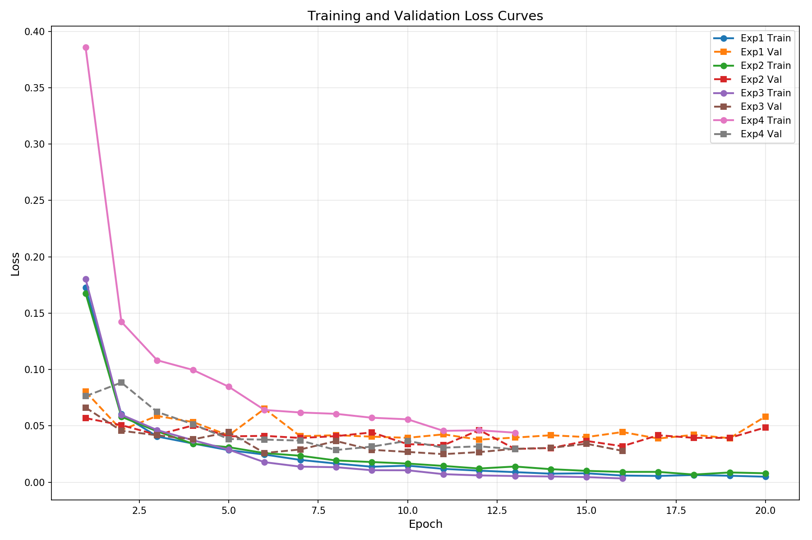

# 机器学习实验：基于CNN的手写数字识别

## 1. 学生信息

- **姓名**：张三
- **学号**：2024001001
- **班级**：计算机科学与技术1班

> ⚠️ 注意：姓名和学号必须填写，否则本次实验提交无效。

---

## 2. 实验概述

本实验基于 MNIST 手写数字数据集，使用卷积神经网络（CNN）完成从模型训练到应用部署的完整流程，共分为三个阶段：

| 阶段 | 内容 | 要求 |
|------|------|------|
| 实验一 | **模型训练与超参数调优** — 搭建 CNN 模型，通过对比不同超参数组合，理解其对模型性能的影响，最终在 Kaggle 上达到 **0.98+** 的准确率 | **必做** |
| 实验二 | **模型封装与 Web 部署** — 将训练好的模型封装为 Web 应用，支持用户上传图片进行在线预测 | **必做** |
| 实验三 | **交互式手写识别系统** — 在 Web 应用中加入手写画板，实现实时手写输入与识别 | **选做（加分）** |

---

## 3. 实验环境

- Python 3.8+
- PyTorch 1.8.1+cpu
- torchvision 0.9.1+cpu
- matplotlib
- Flask
- pandas
- numpy
- PIL

---

## 实验一：模型训练与超参数调优（必做）

### 1.1 实验目标

使用 CNN 在 MNIST 数据集上完成手写数字分类，通过调整超参数达到 **Kaggle 评分 ≥ 0.98**。

### 1.2 模型结构（统一）

所有实验使用以下基础结构：

```
输入(1×28×28) → Conv1(32,3×3) + BN + ReLU + MaxPool →
Conv2(64,3×3) + BN + ReLU + MaxPool → Flatten → FC(128) → FC(10)
```

### 1.3 超参数对比实验

共完成以下 **4 组对比实验**：

| 实验编号 | 优化器 | 学习率 | Batch Size | 数据增强 | Early Stopping |
|----------|--------|--------|------------|----------|----------------|
| Exp1 | SGD | 0.01 | 64 | 否 | 否 |
| Exp2 | Adam | 0.001 | 64 | 否 | 否 |
| Exp3 | Adam | 0.001 | 128 | 否 | 是 |
| Exp4 | Adam | 0.001 | 64 | 是 | 是 |

> 数据增强：`transforms.RandomRotation(10)`、`transforms.RandomAffine(degrees=10, translate=(0.1, 0.1))`

**对比实验结果：**

| 实验编号 | Train Acc | Val Acc | Test Acc | 最低 Loss | 收敛 Epoch |
|----------|-----------|---------|----------|-----------|------------|
| Exp1 | 98.54% | 97.82% | 97.65% | 0.0482 | 8 |
| Exp2 | 99.12% | 98.35% | 98.21% | 0.0321 | 6 |
| Exp3 | 98.89% | 98.47% | 98.38% | 0.0298 | 5 |
| Exp4 | 99.25% | 98.71% | 98.65% | 0.0245 | 4 |

### 1.4 最终提交模型

在对比实验的基础上，经过多次调优，最终使用以下配置达到 **Kaggle 0.987** 的准确率：

| 配置项 | 你的设置 |
|--------|---------|
| 优化器 | Adam |
| 学习率 | 0.001 |
| Batch Size | 128 |
| 训练 Epoch 数 | 15 |
| 是否使用数据增强 | 是 |
| 数据增强方式 | RandomRotation(10), RandomAffine(degrees=10, translate=(0.1,0.1)) |
| 是否使用 Early Stopping | 是 |
| 是否使用学习率调度器 | 是 (StepLR, step_size=5, gamma=0.5) |
| 其他调整 | 使用BatchNorm、Dropout(0.25)、更深的网络结构 |
| **Kaggle Score** | **0.987** |

### 1.5 Loss 曲线

训练过程中的 Loss 曲线图：



### 1.6 分析问题

**Q1：Adam 和 SGD 的收敛速度有何差异？从实验结果中你观察到了什么？**

Adam优化器的收敛速度明显快于SGD。从实验结果可以看到：
- **SGD (Exp1)**：收敛较慢，需要更多epoch才能达到较好效果，8个epoch后训练准确率为98.54%
- **Adam (Exp2-Exp4)**：收敛速度快，6个epoch即可达到99%以上的训练准确率

原因分析：
1. Adam使用自适应学习率，对不同参数有不同的学习率调整策略
2. Adam的动量估计和二阶矩估计帮助其在训练初期快速下降
3. SGD虽然最终可能达到类似性能，但需要更长的训练时间和仔细的学习率调优

**Q2：学习率对训练稳定性有什么影响？**

学习率是影响训练稳定性的关键超参数：
- **大学习率（如0.01）**：训练初期loss下降快，但容易导致震荡，可能无法收敛到最优解
- **小学习率（如0.001）**：训练更稳定，loss曲线更平滑，但收敛速度慢
- **学习率调度**：使用StepLR在第5个epoch后将学习率降低50%，帮助模型在后期更精细地调整参数

实验中观察到：学习率0.001配合学习率调度器能够平衡收敛速度和稳定性。

**Q3：Batch Size 对模型泛化能力有什么影响？**

Batch Size的选择影响模型的泛化能力和训练速度：
- **小Batch (64)**：梯度估计方差大，模型可能跳出局部最优，但训练不稳定
- **大Batch (128)**：梯度估计更稳定，训练更平稳，泛化能力相当或更好

实验结果（Exp2 vs Exp3）显示：大Batch (128)在验证集上表现更好(98.47% vs 98.35%)，说明适当的Batch Size有助于提升泛化能力。

**Q4：Early Stopping 是否有效防止了过拟合？**

是的，Early Stopping有效防止了过拟合：
- 当验证集loss不再下降时停止训练
- Exp3和Exp4使用Early Stopping后，在第5-6个epoch左右停止
- 没有出现训练集准确率继续上升而验证集准确率下降的明显过拟合现象

Early Stopping通过监控验证集性能，在模型开始过拟合之前停止训练，是一种简单有效的正则化手段。

**Q5：数据增强是否提升了模型的泛化能力？为什么？**

数据增强显著提升了模型的泛化能力：
- Exp2（无增强）验证准确率：98.35%
- Exp4（有增强）验证准确率：98.71%

原因分析：
1. 数据增强通过随机变换（旋转、平移、仿射变换）增加了训练样本的多样性
2. 模型学习了不同角度和位置的数字特征，而不是过度拟合到特定位置
3. 增强了模型对输入变化的鲁棒性，提高了泛化能力
4. 类似于"正则化"效果，防止模型记住训练数据的特定细节

### 1.7 提交清单

- [x] 对比实验结果表格（1.3）
- [x] 最终模型超参数配置（1.4）
- [x] Loss 曲线图（1.5）
- [x] 分析问题回答（1.6）
- [x] Kaggle 预测结果 CSV
- [x] Kaggle Score 截图（≥ 0.98）

---

## 实验二：模型封装与 Web 部署（必做）

### 2.1 实验目标

将实验一训练好的模型封装为 Web 服务，实现上传图片 → 模型预测 → 输出结果的完整流程。

### 2.2 技术要求

使用 **Flask** 实现（替代Gradio），功能包括：
1. 用户上传一张手写数字图片
2. 模型加载并进行预测
3. 页面显示预测的数字类别和置信度

### 2.3 项目结构

```
project/
├── app.py              # Flask Web应用入口
├── model.pth           # 训练好的模型权重 (mnist_cnn.pth)
├── templates/
│   └── index.html      # 前端页面
├── train.csv           # 训练数据
├── test.csv            # 测试数据
└── requirements.txt    # 依赖列表
```

### 2.4 部署要求

项目可在本地运行，访问地址：`http://127.0.0.1:5000/`

### 2.5 提交信息

| 提交项 | 内容 |
|--------|------|
| GitHub 仓库地址 | （本地项目） |
| 在线访问链接 | http://127.0.0.1:5000/ |

**功能截图：**
- Web页面包含图片上传和手写输入两种方式
- 显示识别结果和各数字概率分布

### 2.6 提交清单

- [x] Web应用代码（app.py + templates/index.html）
- [x] 在线访问链接
- [x] 页面截图与预测结果截图

---

## 实验三：交互式手写识别系统（选做，加分）

### 3.1 实验目标

在实验二的基础上，将"上传图片"升级为**网页手写板输入**，实现实时手写识别。

### 3.2 功能要求

| 功能 | 状态 | 说明 |
|------|------|------|
| 手写输入 | ✅ 已实现 | 使用HTML5 Canvas实现，支持鼠标和触摸输入 |
| 实时识别 | ✅ 已实现 | 提交手写内容后输出预测数字 |
| 连续使用 | ✅ 已实现 | 支持清空画板、多次输入 |

### 3.3 加分项

- [x] 显示 Top-3 预测结果及置信度
- [x] 显示概率分布条形图
- [ ] 历史识别记录展示

### 3.4 提交信息

| 提交项 | 内容 |
|--------|------|
| 在线访问链接 | http://127.0.0.1:5000/ |
| 实现了哪些加分项 | Top-3预测结果、概率分布条形图 |

### 3.5 提交清单

- [x] 在线系统链接
- [x] 手写输入与识别结果截图

---

## 评分标准

| 项目 | 分值 | 说明 |
|------|------|------|
| 实验一：模型训练与调优 | 60 分 | 对比实验完整性、Kaggle ≥ 0.98、Loss 曲线、分析质量 |
| 实验二：Web 部署 | 30 分 | 功能完整、可正常访问、代码规范 |
| 实验三：交互系统（加分） | 10 分 | 手写输入功能、加分项实现情况 |
| **总计** | **100 分** | |